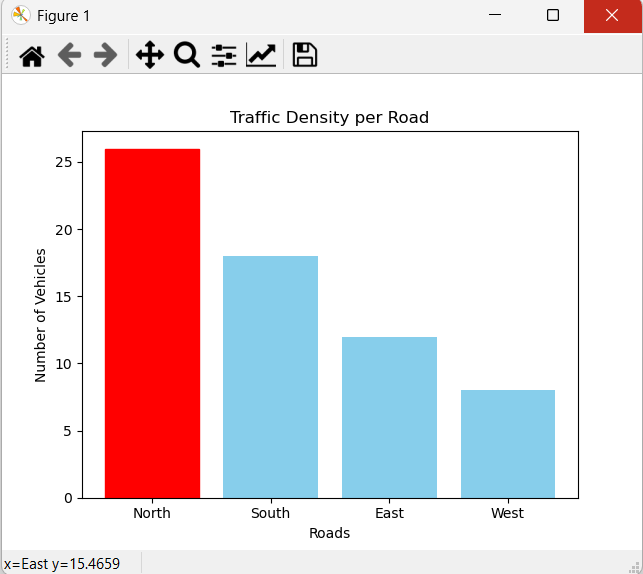

# Smart Traffic Control System using AI

## Overview
This project simulates an intelligent traffic signal control system using AI-based logic to reduce congestion and optimize traffic flow.

## Features
- Adaptive traffic signal timing
- Simulation of vehicle density
- Comparison of static vs dynamic signals
- Performance metrics calculation

## Tech Stack
- Python
- NumPy
- Matplotlib

## How to Run
python traffic_control.py

## 📷 Sample Output

